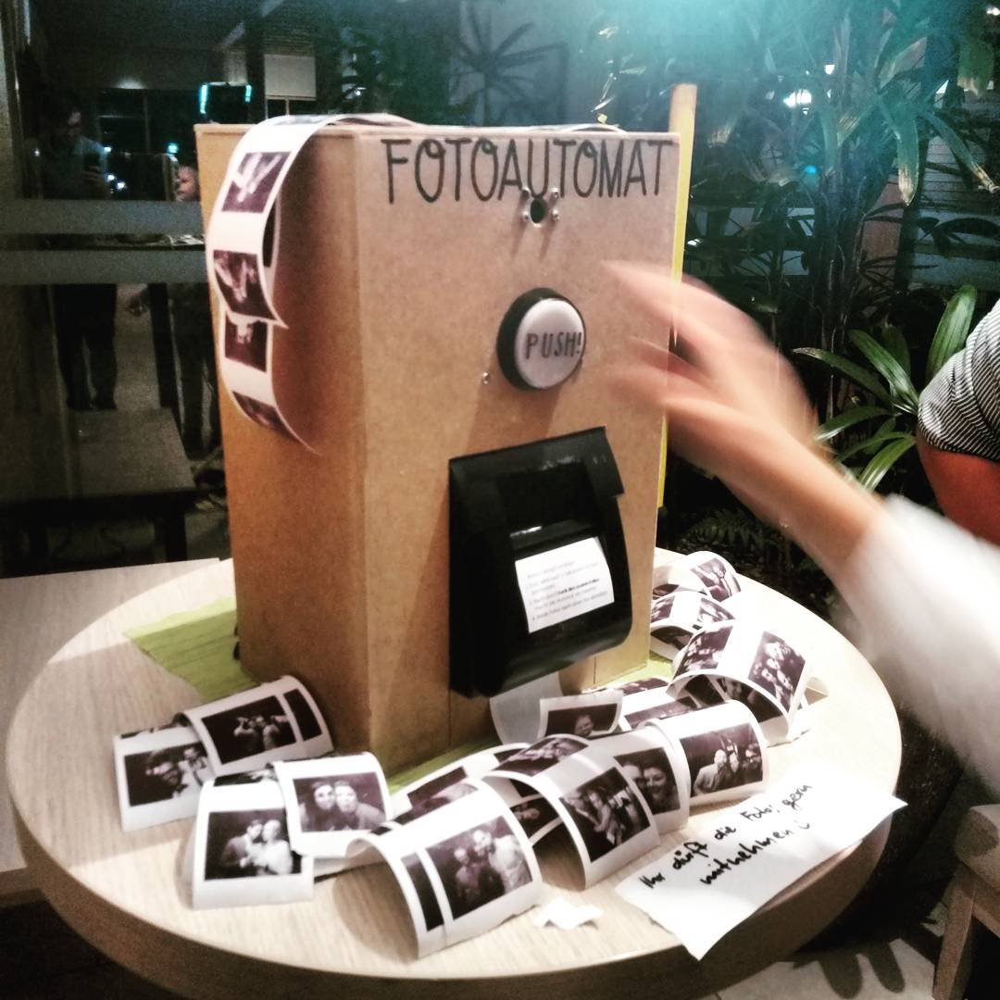

# raspi-photo-booth

> Selfmade thermal printing photobooth featuring raspberry power. &lt;3



### Hardware used

* Raspberry PI Model B
* Raspberry NOIR Camera
* Adafruit 60mm Arcade LED Button
* POS58 Thermal Printer
* Analog Buzzer

### Getting started

```
# Clone the repository
git clone https://github.com/kriskbx/raspi-photo-booth

# Install supervisor
sudo apt-get install supervisord

# Install python requirements
pip install pillow picamera escpos RPi.GPIO

# Add and edit the supervisor-conf to match your paths
cp PhotoBooth.conf /etc/supervisor/conf.d/
vim /etc/supervisor/conf.d/PhotoBooth.conf

# Edit the script to match your GPIO pins and your printer
vim PhotoBooth.py

# Update and start supervisor
sudo supervisorctl reread
sudo supervisorctl update
sudo supervisorctl start photo-booth
```

### curcuit diagram

coming soon.
